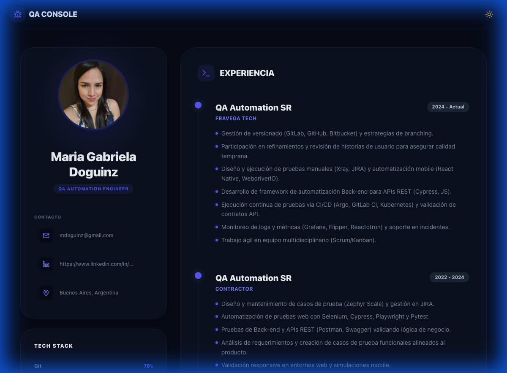

<p align="center">
  
</p>

<h1 align="center">
  🐞 QA Console Portfolio
</h1>

<p align="center">
  <strong>Portafolio profesional interactivo para QA Engineers</strong>
</p>

<p align="center">
  
  
  
  
</p>

<br />

<p align="center">
  
</p>

---

## ✨ Características

<table>
  <tr>
    <td align="center" width="33%">
      
      <br />
      <strong>Modo Oscuro/Claro</strong>
      <br />
      <sub>Tema adaptable con transiciones suaves</sub>
    </td>
    <td align="center" width="33%">
      
      <br />
      <strong>Animaciones Fluidas</strong>
      <br />
      <sub>Powered by Framer Motion</sub>
    </td>
    <td align="center" width="33%">
      
      <br />
      <strong>100% Responsive</strong>
      <br />
      <sub>Optimizado para todos los dispositivos</sub>
    </td>
  </tr>
  <tr>
    <td align="center">
      
      <br />
      <strong>Edición en Vivo</strong>
      <br />
      <sub>Modifica tu contenido directamente</sub>
    </td>
    <td align="center">
      
      <br />
      <strong>Persistencia Local</strong>
      <br />
      <sub>Datos guardados en localStorage</sub>
    </td>
    <td align="center">
      
      <br />
      <strong>Ultra Rápido</strong>
      <br />
      <sub>Build con Vite + React 19</sub>
    </td>
  </tr>
</table>

---

## 🚀 Inicio Rápido

```bash
# Clonar el repositorio
git clone https://github.com/tu-usuario/mi-portafolio.git

# Entrar al directorio
cd mi-portafolio

# Instalar dependencias
npm install

# Iniciar servidor de desarrollo
npm run dev
```

Abre [http://localhost:5173](http://localhost:5173) en tu navegador.

---

## 📂 Estructura del Proyecto

```
mi-portafolio/
├── 📄 index.html          # Punto de entrada HTML
├── 📁 src/
│   ├── 📄 App.jsx         # Componente principal
│   └── 📄 index.css       # Estilos globales
├── 📁 public/             # Assets estáticos
├── 📄 vite.config.js      # Configuración de Vite
├── 📄 package.json        # Dependencias
└── 📄 README.md           # Este archivo
```

---

## 🎨 Secciones del Portafolio

| Sección | Descripción |
|---------|-------------|
| 👤 **Perfil** | Foto, nombre, rol y datos de contacto |
| 💼 **Experiencia** | Timeline profesional con descripciones detalladas |
| 🎓 **Educación** | Carreras y certificaciones |
| 🛠️ **Tech Stack** | Skills con barras de progreso animadas |
| 📱 **Proyectos** | Galería con mockups web y mobile |

---

## ⚙️ Scripts Disponibles

| Comando | Descripción |
|---------|-------------|
| `npm run dev` | Inicia el servidor de desarrollo |
| `npm run build` | Genera el build de producción |
| `npm run preview` | Previsualiza el build |
| `npm run lint` | Ejecuta ESLint |

---

## 🛠️ Tecnologías

<p align="center">
  <a href="https://react.dev"></a>
  <a href="https://vitejs.dev"></a>
  <a href="https://tailwindcss.com"></a>
  <a href="https://www.framer.com/motion"></a>
</p>

---

## 📝 Personalización

Edita el objeto `defaultData` en `src/App.jsx` para modificar:

```javascript
const defaultData = {
  name: "Tu Nombre",
  role: "Tu Rol Profesional",
  photo: "URL de tu foto",
  contactInfo: [...],
  experience: [...],
  education: [...],
  skills: [...],
  projects: [...]
}
```

---

## 📄 Licencia

Este proyecto está bajo la licencia MIT. Siéntete libre de usarlo y modificarlo.

---

<p align="center">
  <strong>Hecho con 💜 y mucho ☕</strong>
</p>

<p align="center">
  <a href="https://www.linkedin.com/in/mgabynunez">
    
  </a>
  <a href="mailto:mdoguinz@gmail.com">
    
  </a>
  <a href="https://github.com/mdoguinz27">
    
  </a>
</p>
